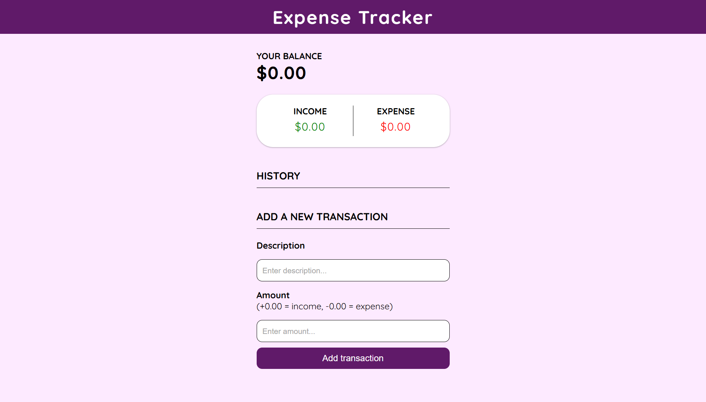
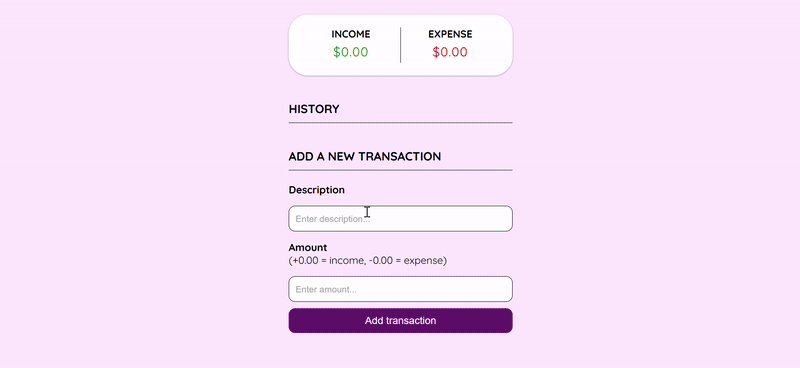

# Expense Tracker
A simple **Expense Tracker** built with HTML, CSS, and JavaScript. This app helps you manage your personal finances by tracking your income, expenses, and balance. All transactions are stored in your browser's local storage, so your data persists even after refreshing or closing the tab.

### Features
- Add transactions with a description and an amount.
- Track income, expenses and balance in real time.
- Delete transactions easily.
- Data persistence with localStorage.

### Technologies used
- **HTML5** - structure.
- **CSS3** - styling.
- **JavaScript** - app logic & localStorage handling.

## Installation guide
1. Clone or download this repository: ``git clone https://github.com/dianabali/expense-tracker.git``
2. Open ``index.html`` in zour browser.
3. Start adding transactions.

## Images

